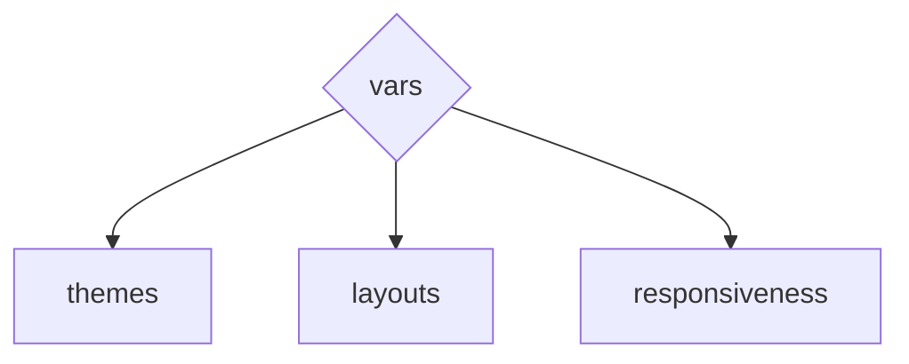
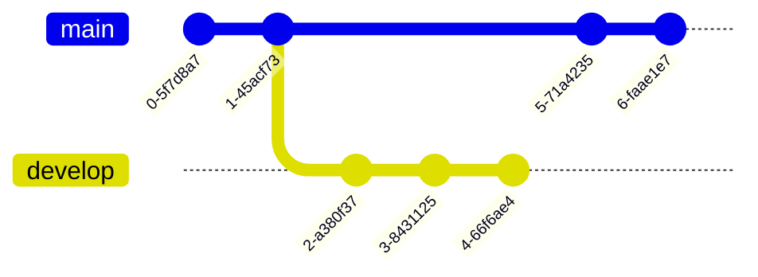

# DEV NOTES : :
Updated: `2023.10.21 12:13:57`
By: [@D7460N](https://github.com/D7460N)

<br />

---

<br />

## ARTICLES : :

[Definitive edition of "How to Favicon" in 2023](https://dev.to/masakudamatsu/favicon-nightmare-how-to-maintain-sanity-3al7) [ 2023.08.11 ]
I thought adding a favicon to my website was a simple thing: create a file called favicon.ico, save it in the root directory, and add the code to the `<head>` section of the HTML file. I was wrong. ~ [Masa Kudamatsu](https://dev.to/masakudamatsu)

[When to Nest](https://cloudfour.com/thinks/when-to-nest-css/) [ 2023.10.05 ]
With the recent news that CSS nesting is now available in the major evergreen browsers, our team was discussing how it differs from nesting in Sass, and the question came up — When should you use nesting? ~ [Scott Vandehey](https://cloudfour.com/is/scott/)

[Custom CSS Reset](https://www.joshwcomeau.com/css/custom-css-reset/) [ 2023.06.09 ]
I removed the height: 100% from html and body. This rule was added to make it possible to use percentage-based heights within the application. Now that dynamic viewport units are well-supported, however, this hacky fix is no longer required. ~ [Josh W. Comeau](https://www.joshwcomeau.com/)

[color-scheme](https://web.dev/articles/color-scheme) [ 2020.04.08 ]
Improved dark mode default styling with the color-scheme CSS property and the corresponding meta tag ~ [Thomas Steiner](https://blog.tomayac.com/)

[Creating a CSS-Only Toggle Switch](https://alvaromontoro.com/blog/68017/creating-a-css-only-toggle-switch) [ 2022.10.11 ]
Many articles about this topic are "outdated" or implement old-school solutions (even the most recently published ones!) Also, most overlook essential parts of web development, such as web accessibility or usability. Finally, I wanted to go beyond the "what" or the "how" and focus on the "why." ~ [Alvaro Montoro](https://alvaromontoro.com/)

[You Don’t Need A UI Framework](https://www.smashingmagazine.com/2022/05/you-dont-need-ui-framework/) [ 2022.05.03 ]
Developers often reach for UI frameworks like Bootstrap or Material UI, hoping that they’ll save a bunch of time and quickly build a professional-looking app. Unfortunately, things rarely work out this way. Let’s talk about it. ~ [Josh W. Comeau](https://www.smashingmagazine.com/author/josh-comeau/)

[The Surprising Truth About Pixels and Accessibility](https://www.joshwcomeau.com/css/surprising-truth-about-pixels-and-accessibility/) [ 2022.11.29 ]
The truth is, if you want to build the most-accessible product possible, you need to use both pixels and ems/rems. It's not an either/or situation. There are circumstances where rems are more accessible, and other circumstances where pixels are more accessible. ~ [Josh W. Comeau](https://www.joshwcomeau.com/)

[Change favicon based on dark/light color mode](https://www.codewithshripal.com/tips/css/change-favicon-based-on-dark-light-mode) [ 2022.05.19 ]
When we use dark color mode, all the native application windows also changes its color to dark. This cause issue that favicon designed for light color mode no longer getting visible properly on dark color mode. ~ [Shripal Soni](https://www.codewithshripal.com/authors/shripal-soni)

[The New CSS Media Query Range Syntax](https://css-tricks.com/the-new-css-media-query-range-syntax/)
We rely on CSS Media Queries for selecting and styling elements based on a targeted condition. That condition can be all kinds of things but typically fall into two camps: (1) the type of media that’s being used, and (2) a specific feature of the browser, device, or even the user’s environment. ~ [Preethi Selvam](https://css-tricks.com/author/selvampreethi/) [ 2022.10.31 ]

[Using Grid Named Areas to Visualize (and Reference) Your Layout](https://css-tricks.com/using-grid-named-areas-to-visualize-and-reference-your-layout/)
Whenever we build simple or complex layouts using CSS Grid, we’re usually positioning items with line numbers. Grid layouts contain grid lines that are automatically indexed with positive and negative line numbers (that is unless we explicitly name them). Positioning items with line numbers is a fine way to lay things out, though CSS Grid has numerous ways to accomplish the same with an undersized cognitive encumbrance. ~ [Preethi Selvam](https://css-tricks.com/author/selvampreethi/) [ 2022.08.26 ]

<br />

---

<br />

## 3RD PARTY DEPENDENCIES : :

[Swiper - The Most Modern Mobile Touch Slider](https://swiperjs.com/) [ 2023.09.28 ]
Swiper is the most modern free and open source mobile touch slider with hardware accelerated transitions and amazing native behavior. Use it on websites, web apps, and mobile native/hybrid apps.

[Favicon Generator. For real.](https://realfavicongenerator.net/) [ 2018.01.22 ]
Convert SVG image into favicon.ico, apple-touch-icon.png, android-chrome-192x192.png, and android-chrome-512x512.png

[chartscss.org](https://chartscss.org/) [ 2023.10.10 ]
Charts.css is an open source CSS framework for data visualization. No dependencies. 76kb minified size. 7kb gzipped file size!

<br />

---

<br />

## CODE SNIPPETS : :

### RESPONSIVE BREAKPOINTS : :

[Essential CSS Breakpoints for Web Developers](https://twitter.com/csaba_kissi/status/1714168372785725623) ~ [Csaba Kissi](https://twitter.com/csaba_kissi) [ 2023.10.23 ]

TODO: Convert to modern `arrow` syntax

```css
/* Mobile: Up to 480px */
@media (max-width: 480px) {/* styles */}

/* Extra small devices: 481px to 767px */
@media (min-width: 481px) and (max-width: 767px) {/* styles */}

/* Small tablets: 768px to 991px */
@media (min-width: 768px) and (max-width: 991px) {/* styles */}

/* Large tablets/laptops: 992px to 1199px */
@media (min-width: 992px) and (max-width: 1199px) {/* styles */}

/* Desktops: 1200px to 1919px */
@media (min-width: 1200px) and (max-width: 1919px) {/* styles */}

/* Extra large screens: 1920px and up */
@media (min-width: 1920px) {/* styles */}
```

<br />

### FONT-STACKS : :

[https://systemfontstack.com/](https://systemfontstack.com/)

Basic system font stacks

Sans-serif:

```css
body {
  font-family: -apple-system, BlinkMacSystemFont, avenir next, avenir, segoe ui, helvetica neue, helvetica, Cantarell, Ubuntu, roboto, noto, arial, sans-serif;
}
```

Serif:

```css
body {
  font-family: Iowan Old Style, Apple Garamond, Baskerville, Times New Roman, Droid Serif, Times, Source Serif Pro, serif, Apple Color Emoji, Segoe UI Emoji, Segoe UI Symbol;
}
```

Mono:

```css
body {
  font-family: Menlo, Consolas, Monaco, Liberation Mono, Lucida Console, monospace;
}
```

<br />

---

<br />

### THEMES : :

Requirements:

1. Avoid flash of unstyled content (FOUC):
   1. Directly override default UA stylesheet to avoid FOUC.
   2. Must use `color-scheme` in `:root{ }`
2. Toggle theme
   1. Regardless of current theme
   or
   2. Set `checkbox` state based on current `color-scheme`
3. Not repeat styles
   1. Use custom properties (variables)
4. CSS only!


<br />

---

<br />

### CUSTOM PROPERTIES : :


### Mermaid diagrams
[https://mermaid.js.org/intro/](https://mermaid.js.org/intro/)

[https://docs.github.com/en/get-started/writing-on-github/working-with-advanced-formatting/creating-diagrams](https://docs.github.com/en/get-started/writing-on-github/working-with-advanced-formatting/creating-diagrams)

Git-Graph
[https://mermaid.js.org/intro/#git-graph](https://mermaid.js.org/intro/#git-graph)


